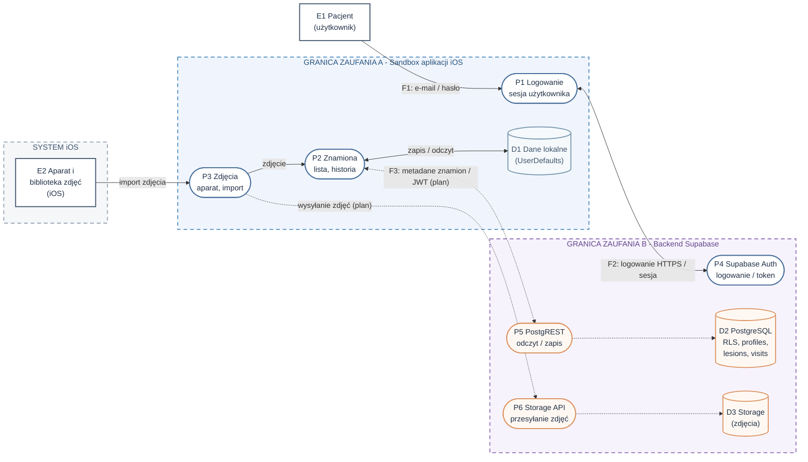

```mermaid


flowchart LR
    %% ENCJE ZEWNĘTRZNE
    E1["E1 Pacjent<br/>(użytkownik)"]

    %% SYSTEM IOS
    subgraph IOS["SYSTEM iOS"]
        E2["E2 Aparat i<br/>biblioteka zdjęć<br/>(iOS)"]
    end

    %% GRANICA ZAUFANIA A
    subgraph APP["GRANICA ZAUFANIA A - Sandbox aplikacji iOS"]
        direction TB

        P1(["P1 Logowanie<br/>sesja użytkownika"])
        P2(["P2 Znamiona<br/>lista, historia"])
        P3(["P3 Zdjęcia<br/>aparat, import"])
        D1[("D1 Dane lokalne<br/>(UserDefaults)")]

        P3 -->|"zdjęcie"| P2
        P2 <-->|"zapis / odczyt"| D1
    end

    %% GRANICA ZAUFANIA B
    subgraph BACK["GRANICA ZAUFANIA B - Backend Supabase"]
        direction TB

        P4(["P4 Supabase Auth<br/>logowanie / token"])
        P5(["P5 PostgREST<br/>odczyt / zapis"])
        P6(["P6 Storage API<br/>przesyłanie zdjęć"])

        D2[("D2 PostgreSQL<br/>RLS, profiles,<br/>lesions, visits")]
        D3[("D3 Storage<br/>(zdjęcia)")]

        P5 -.-> D2
        P6 -.-> D3
    end

    %% PRZEPŁYWY DANYCH
    E1 -->|"F1: e-mail / hasło"| P1
    E2 -->|"import zdjęcia"| P3

    P1 <-->|"F2: logowanie HTTPS / sesja"| P4

    P2 <-.->|"F3: metadane znamion / JWT (plan)"| P5

    P3 -.->|"wysyłanie zdjęć (plan)"| P6

    %% STYLE
    classDef external fill:#ffffff,stroke:#40546b,stroke-width:2px,color:#203047
    classDef process fill:#ffffff,stroke:#4b719d,stroke-width:2px,color:#203047
    classDef planned fill:#fff8f2,stroke:#dc9463,stroke-width:2px,color:#203047
    classDef storage fill:#f5f9fc,stroke:#7595ad,stroke-width:2px,color:#40546b

    class E1,E2 external
    class P1,P2,P3,P4 process
    class P5,P6 planned
    class D1 storage
    class D2,D3 planned

    style APP fill:#f0f5fd,stroke:#528fc1,stroke-width:2px,stroke-dasharray:8 6,color:#28527c
    style BACK fill:#f7f3fd,stroke:#9475ba,stroke-width:2px,stroke-dasharray:8 6,color:#62458b
    style IOS fill:#f5f7f9,stroke:#9aa7b4,stroke-width:2px,stroke-dasharray:8 6,color:#40546b


```